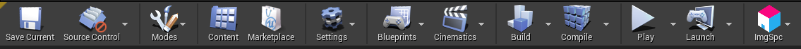
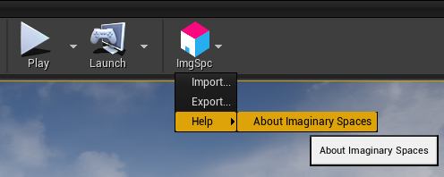

# Python Toolbar Button & Menu Creator
A handy plugin to create and extend toolbar buttons and menus in the Unreal Editor using Python.

## Getting Started
To start extending the Editor UI in Unreal, follow these steps:

1. Open a project in Unreal 4.25 and create a new plugin (any template can be chosen). This can be done in the Plugins window (Edit > Plugins) by clicking the "New Plugin" button.
2. Purchase the Python Toolbar Button and Menu Creator plugin from the Unreal Marketplace and enable it for your project in the Plugins window.
3. Add the UnrealMenuItem module as a dependency in the plugin descriptor (.uplugin) file of your plugin.
```
	"Plugins": [
		{
			"Name": "UnrealMenuItem",   
			"Enabled": true   
		}          
	] 
```
4. In your plugin's Content directory, create a folder called Python in which you can add a file called `init_unreal.py`. This file will be loaded and executed by Unreal during startup and should include all toolbar button and menu creation code.
5. Restart the Editor to apply your changes to the Editor UI.

## Using the Python API
To start using the python API, you must first import the `imgspc` module.

The core functionality of the plugin is exposed through the `imgspc.make_menu_item` function that lets python developers define the structure of the menu they want to add to the Unreal Editor UI using the `menu_path` parameter.

`imgspc.make_menu_item(menu_path, callback = None, icon_path = None, tooltip = '')`
* menu_path: A `'/'`-delimited string path describing a hierarchy of sub-menus and items.
* icon_path: Path to the icon asset (png) to be added to the toolbar button or menu-item. This path must be relative to the Plugins subfolder within the client's Unreal Project directory.
* callback: A string representation of the python function to be executed when the menu-item is clicked.
* tooltip: Tooltip associated with the menu-item.

## Extending the Level Editor Toolbar
To extend the Level Editor toolbar, provide the name of the toolbar button to be added along with its icon (this is optional). This will add your button to the end of the toolbar.
```
imgspc.make_menu_item('ImgSpc', icon_path='MyPlugin/Icons/imgspc-logo-large.png')
```


## Creating Sub-Menus and Menu Items
The path passed to `make_menu_item` is of the following format `sub-menu name/.../menu-item name` where each nested sub-menu will be created by the plugin if it doesn't already exist. The menu-item will then be added to the end of any existing menu or as the first item of a new menu.

```
imgspc.make_menu_item('ImgSpc/Import...', callback='importer.import_file()', tooltip='Import file')
```

## Specifying a Callback
To associate a callback function with a menu-item, you must provide to the `callback` parameter a string argument that meets the following format: `source_module_name.callback_name(args)` where:

* `source_module_name` is the Python module that contains the callback function definition. This can be set to `init_unreal` if you would like to use callables defined in this module.
* `callback_name` is the name of the callback function to be executed when the menu-item is clicked.
* `args` are any arguments to be passed in to the callback. 

## Adding an Icon
1. Add the icon asset to your plugin directory.
2. Add the path to this asset as a parameter to your call to `make_menu_item`. This path must be relative to your Plugins folder (e.g. `'MyPlugin/Icons/SaveIcon_40x.png'`).

## Imaginary Spaces Example


init_unreal.py
```
import unreal
import imgspc
import importer, exporter, utilities

# Create a singular parent menu
imgspc.make_menu_item('ImgSpc', icon_path='MyPlugin/Icons/imgspc-logo-large.png')

# Create a menu-item that executes the provided callback when clicked
imgspc.make_menu_item('ImgSpc/Import...', callback='importer.import_file()', tooltip='Import file')
imgspc.make_menu_item('ImgSpc/Export...', callback='exporter.export_file('.gltf')', tooltip='Export file')

# Create a nested sub-menu and menu-item with the provided icon
imgspc.make_menu_item(
    menu_path='ImgSpc/Help/About Imaginary Spaces',
    callback='utilities.load_docs()',
    icon_path='MyPlugin/Icons/DocIcon_40x.png',
    tooltip='Load documentation'
)
```

importer.py
```
def import_file():
    print('Importing file...')
    ...
```

exporter.py
```
def export_file(file_extension = '.fbx'):
    print('Exporting file as {}'.format(file_extension))
    ...
```

# Extending the Main Menu bar in the Unreal Editor
To extend the Main Menu bar of the Level Editor, the root item of your `menu_path` must be set to `LevelEditor.MainMenu`.

```
imgspc.make_menu_item('LevelEditor.MainMenu/ImgSpc/Import...', callback='importer.import_file()', tooltip='Import file')
imgspc.make_menu_item('LevelEditor.MainMenu/ImgSpc/Export...', callback="exporter.export_file()", tooltip='Export file')
imgspc.make_menu_item('LevelEditor.MainMenu/ImgSpc/Help/About Imaginary Spaces', callback="utilities.load_docs()", tooltip='Load documentation')
```